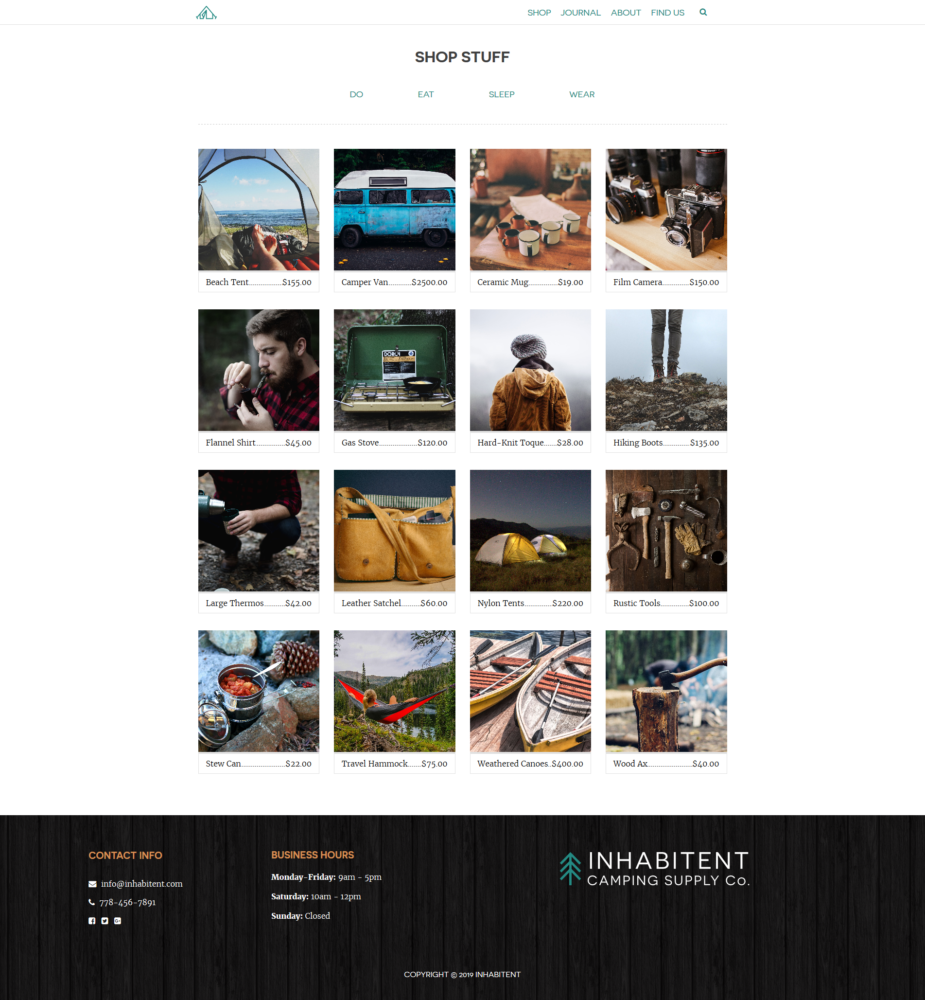
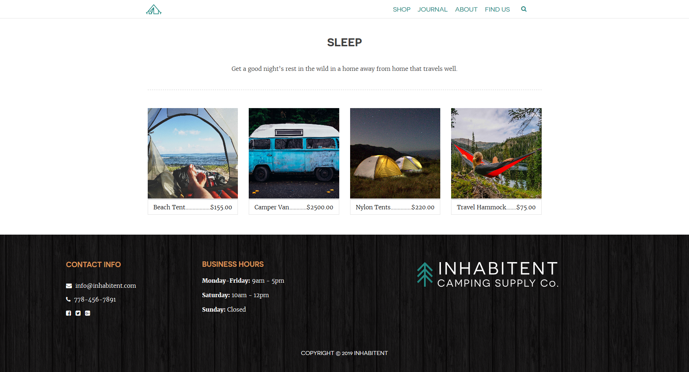
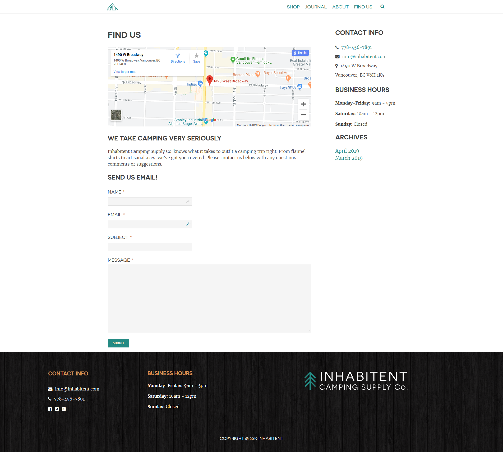

    

## Inhabitent Site 🧸⛺

WP-based theme inspired by the outdoors and active lifestyle with custom made plugins for it's own functionality. Built with HTML, WordPress, CSS, PHP & vanilla JS.

This project is an e-commerce website for a camping company with a blog section for custom posts and a shop page where the products are displayed for sale.

## Installation

### 1. Download the repo (don't clone it!)

Then add me to your wp-content directory.

### 2. Rename the directory

Make sure that the theme directory name is project appropriate!

### 3. Install the dev dependencies

Next you'll need to run `npm install` **inside your theme directory** next to install the node modules you'll need for Gulp, etc.

### 4. Update the proxy in `gulpfile.js`

Lastly, be sure to update your `gulpfile.js` with the appropriate URL for the Browsersync proxy (so change `localhost[:port-here]/[your-dir-name-here]` to the appropriate localhost URL).

---

### Technologies Used

* VS Code
* Wordpress
* HTML
* SASS
* PHP
* JavaScript
* Gulp

## Project Comps
### Front Page

### Shop

### Taxonomies

### Journal

### About

### Find Us

---

This project was created with 💙 by <a href="https://twitter.com/hallorob">Roberto</a>